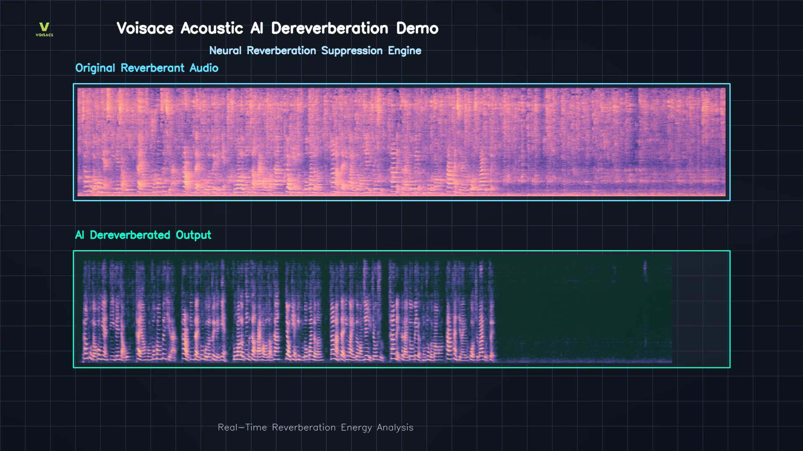
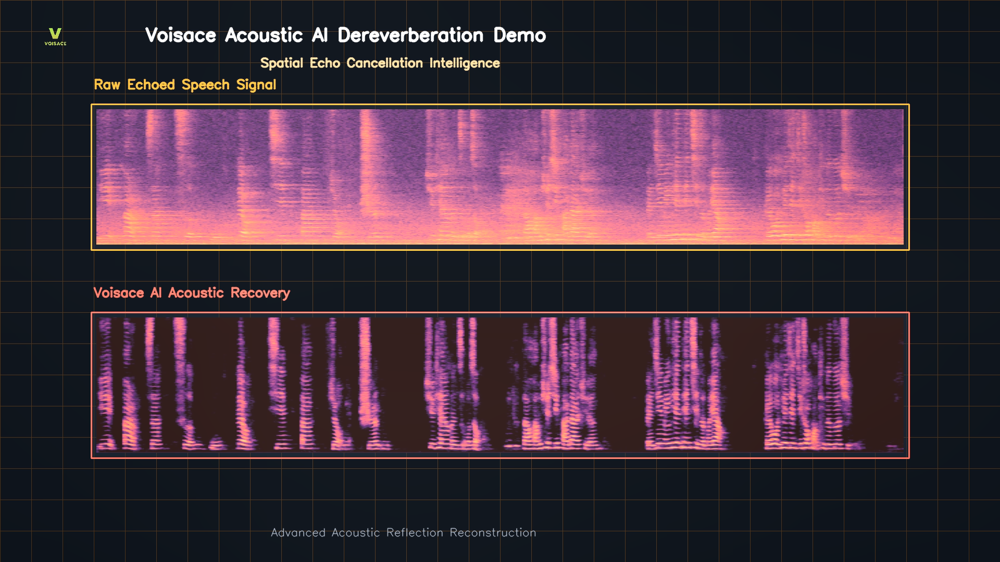

# VOISACE AI Dereverberation Demo

<p align="center">
  
</p>

Advanced AI-powered speech enhancement technology for removing reverberation and restoring speech clarity in real-world acoustic environments.

---

## Demo Videos

### Demo 01 – AI Dereverberation Processing

Watch the original demonstration video stored in this repository:

[▶ View Demo 01](./Voisace_Dereverb_Demo_01.mp4)

This demo demonstrates Voisace's real-time AI dereverberation technology for improving speech intelligibility in reverberant acoustic environments.

---

### Demo 02 – AI Dereverberation Spectrogram Analysis

[](https://youtu.be/1knoUV_MIjg)

▶ Click the image above to watch the full demo on YouTube.

This demonstration showcases spectrogram comparisons before and after processing, highlighting the effectiveness of Voisace's Acoustic AI recovery engine.

YouTube:
https://youtu.be/1knoUV_MIjg

---

## Overview

Reverberation caused by room reflections can significantly degrade speech quality and reduce intelligibility.

The Voisace AI Dereverberation Engine utilizes advanced Acoustic AI algorithms to suppress reverberation while preserving speech naturalness and clarity.

Our technology is designed for real-time deployment on embedded systems, communication devices, conferencing products, and intelligent audio platforms.

---

## Key Features

* AI Speech Dereverberation
* Real-Time Acoustic Recovery
* Speech Intelligibility Enhancement
* Low-Latency Processing
* Embedded AI Deployment
* Edge Computing Optimized
* DSP + AI Hybrid Architecture
* Conference Audio Enhancement
* Smart Microphone Integration
* Voice Communication Optimization

---

## Applications

### Smart Conferencing Systems

Improve meeting audio quality in reverberant rooms.

### AI Voice Assistants

Increase speech recognition accuracy and user experience.

### Smart Microphones

Deliver cleaner speech capture in challenging acoustic environments.

### VoIP & Communication Devices

Enhance voice transmission quality under real-world conditions.

### Broadcasting & Content Creation

Improve recorded speech quality for professional production workflows.

### Embedded Audio Products

Deploy directly on edge devices with optimized computational efficiency.

---

## Technology Highlights

* Speech Enhancement
* Dereverberation
* Echo Reduction
* Acoustic Recovery
* AI Audio Processing
* Voice Enhancement
* Beamforming Integration
* Embedded Acoustic AI
* Real-Time DSP Processing

---

## Repository Contents

```text
README.md
Cover.png
Dere2.png
Voisace_Dereverb_Demo_01.mp4
LICENSE
```

---

## About Voisace

Voisace develops Embedded Acoustic AI solutions for next-generation audio products.

Our technologies include:

* Speech Enhancement
* Noise Reduction
* Echo Cancellation (AEC)
* Dereverberation
* Beamforming
* Voice Activity Detection (VAD)
* Acoustic Event Detection (AED)
* AI Audio Intelligence

Designed for edge deployment, Voisace solutions help manufacturers integrate advanced audio intelligence into communication devices, conferencing systems, smart microphones, AI assistants, and industrial products.

---

## Connect With Us

Website:
https://www.voisace.com

LinkedIn:
https://www.linkedin.com/company/voisace

YouTube:
https://www.youtube.com/@Voisace

---

## License

Licensed under the Apache License 2.0.

See the LICENSE file for details.
